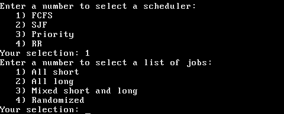

#GeekOS

##About GeekOS

GeekOS is a small operating system kernel by David H. Hovemeyer 
for people who want to learn about OS kernel implementation. 
Although it is not specifically designed for use with course projects, it
provides a balance of simplicity and features that make it well suited for
learning about the inner workings of an operating system Kernel.

This version of GeekOS features contributions from

* Nik Steel
* Todd Baert
* Chris Zygowski
* and Aaron Sarson.

We developed this version as a final project for an introduction to operating
systems course at the University of Windsor.  Our original source code and 
sections of the core GeekOS code that we modified are set apart in the src/60-330
and include/60-330 directories and are documented with comments.

The original GeekOS base kernel upon which our project is based may be found at 

	https://code.google.com/p/geekos/

##Build

###Compile from source

We used a gcc i686 cross compiler to compile our source code.  The steps
that we followed to build our cross compiler may be found here:

	http://wiki.osdev.org/GCC_Cross-Compiler

To build

	cd build/x86/
	make

Note that the make file will compile the code and write it to an iso
called boot.iso in the working directory using grub-mkrescue.
   
Run with qemu

	qemu -kernel kernel/geekos.exe

or

	qemu -cdrom boot.iso

and to test hard drive recognition create an empty device image,
e.g. `dd if=/dev/zero of=./hda.img bs=512 count=100000` and

	qemu -kernel kernel/geekos.exe -hda hda.img

Make bootable usb-stick

	sudo dd if=boot.iso of=/dev/sdb && sync

and replace `sdb` as needed 

###Ready to use ISO
   
For your convenience, a ready to mount ISO is included in the ISO directory.  
Use an i686 virtual machine of your choice to mount the ISO and boot our OS. 
   
   
##Features

Our operating system features the following:
* 5-State Process Model
* Job Submission
* i386 Machine Architecture
* Process and Resource tables / Queues and Management
* Scheduling
* User Processes Synchronization and Simulation
* User Interface and Reporting

The GeekOS command line demonstrates how process synchronization behaves with a series of games:

Select Synchronization and Peterson's Solution in the GeekOS menu, and you will see a pair of processes
that use Peterson's Solution to the critical section problem to exchange control in a tic tac toe game.

Select Synchronization and Mutex in the GeekOS menu, and you will see a group of 
poem-writing processes attempt to write a poem into a shared memory location at the same time. 
The late arriving processes are blocked by the earliest arriving one, which has control of the mutex lock.

We provide four process scheduling algorithms and four job submission scenarios:

The user can see how the processes transition between the five process states.

Runtime statistics are also provided and may be used to compare the performance of each
scheduling algorithm given a particular job submission scenario:

You can read more about the inner workings of these in `/docs/features.md`.

##Copyright, License, and Disclaimer

Copyright (C) 2014-2015, Nik Steel, Todd Baert, Chris Zygowski, and Aaron Sarson 
(for our contributions in the src/60-330 and include/60-330 directories)
Copyright (C) 2001-2008, David H. Hovemeyer <david.hovemeyer@gmail.com>
(for all other code)

This code is free software; you can redistribute it and/or modify it
under the terms of the GNU General Public License version 2 only, as
published by the Free Software Foundation.
 
This code is distributed in the hope that it will be useful, but WITHOUT
ANY WARRANTY; without even the implied warranty of MERCHANTABILITY or
FITNESS FOR A PARTICULAR PURPOSE.  See the GNU General Public License
version 2 for more details (a copy is included in the LICENSE file that
accompanies this code).
